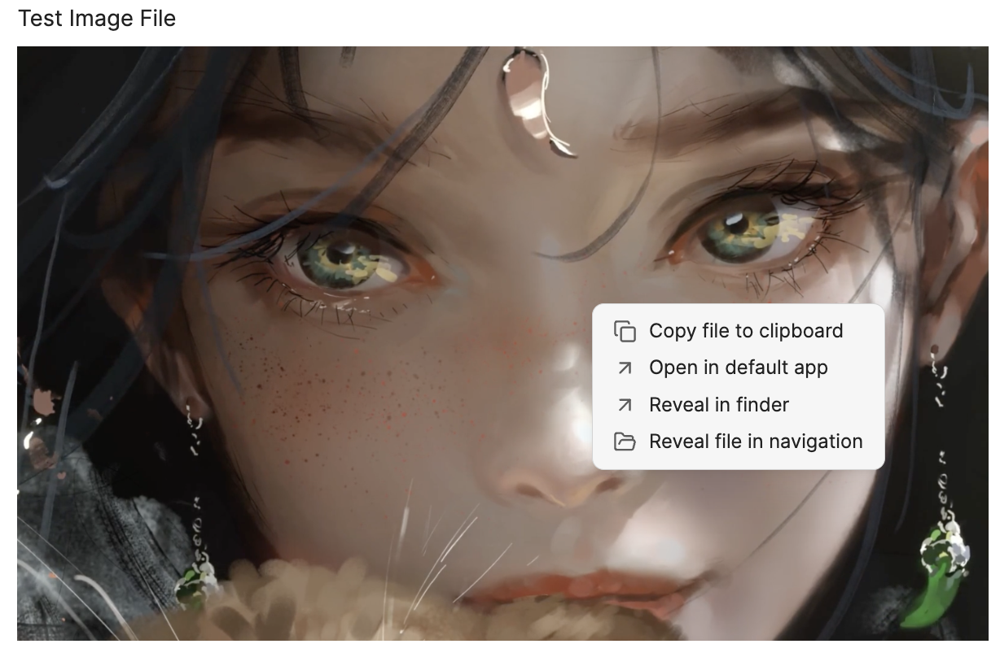

# AttachFlow

中文 / [EN](./README.md)

利用这个插件，您可以在实时编辑或阅读模式下，通过简单的**右键菜单**，轻松管理文档中的附件（图片、视频，录音，文件...）

## 演示
(1)实时预览模式下

(2)阅读模式下

## 删除文件功能详细介绍

特性简介：

1. 右键图片删除图片附件及引用链接，视情况自动删除附件文件夹

2. 文件列表中右键删除笔记同时自动删除引用的附件，视情况自动删除附件文件夹

特性详情：

- 删除图片支持 `markdown `和 `wiki `链接风格的链接
- 支持 三种不同格式的**内部链接类型** （[详情](https://help.obsidian.md/Linking+notes+and+files/Internal+links)）
  1. 尽可能简短的形式
  2. 基于当前笔记的相对路径
  3. 基于仓库根目录的绝对路径
- 支持设置图片删除后的处理方式：① 移动到系统回收站 ； ② 移动到 obsidian trash ; ③ 永久删除

- 除了支持 img 类型的附件，更多类型附件文件，如图片，视频，录音，文件.....（目前不支持右键删除`PDF`附件）

  1. img 类型: img、gif、png、jpeg，svg， bmp...

  1. file 类型: docx、pptx、html、epub...

  1. media 类型: mp4、mkv...

> 删除图片附件及引用链接情况说明：
>
> 1. 该附件**仅被当前链接引用**，则会直接删除该链接，同时删除附件文件。
> 2. 该附件除了当前链接**还有其他地方对其有引用**，则只会删除当前的链接文本，并不会删除该附件文件。

> 删除笔记同时自动删除引用的附件说明：
>
> 1. 如果附件被其他笔记也引用，则不删除。
> 2. 如果附件仅被当前**需被删除的笔记**引用一次或多次，则删除。
> 3. 删除方式：通过插件提供的命令删除 ; 文件列表右键菜单删除

> 视情况自动删除附件文件夹说明：
>
> - 当且仅当被删除的笔记中引用的（图片）附件被当前笔记引用一次，且删除附件文件后，附件文件夹下没有内容时删除附件的父级目录（一般为附件文件夹）

## 安装

### 从插件市场安装

### 从 brat 安装

### 手动安装

方式

- 进入 release 页面，下载`.zip`压缩包，解压得到的文件夹放入`<your_vault>/.obsidian/plugins/`

## 使用

1. 安装并启用插件
2. 在**阅读模式**或者**实时预览模式**鼠标右键图片，在弹出的菜单项目中，点击删除选项

### 删除目的设置

请确保你在本插件的设置界面下选择了被删除图片的目的地。你有 3 个选项。

1. **移动到黑曜石垃圾桶** - 文件将被移动到黑曜石保险库下的`.trash`。
2. **移动到系统垃圾箱** - 文件将被移动到操作系统垃圾箱。
3. **永久删除** - 文件将被永久销毁。你将不能再恢复了

## 开发

这个插件遵循 [Obsidian Sample Plugin](https://github.com/obsidianmd/obsidian-sample-plugin) 插件的结构，请看那里的进一步细节。

## 给我充电

❤ 如果你喜欢使用 Obsidian-Fast-Image-Cleaner，那么请支持我的工作，请给我充电。https://afdian.net/a/nathanel

## 项目说明

本插件是在 [Fast-Image-Clear 插件](https://github.com/martinniee/Obsidian-fast-image-cleaner)v0.8.1 的基础上修改得到。我在其基础上增加了拷贝文件到剪贴板的功能。此外，在默认app打开，在finder中显示，在文件列表显示这三个功能我是参考了 [obsidian-copy-url-in-preview 插件](https://github.com/NomarCub/obsidian-copy-url-in-preview)。

参考项目地址：
- https://github.com/martinniee/Obsidian-fast-image-cleaner
- https://github.com/NomarCub/obsidian-copy-url-in-preview